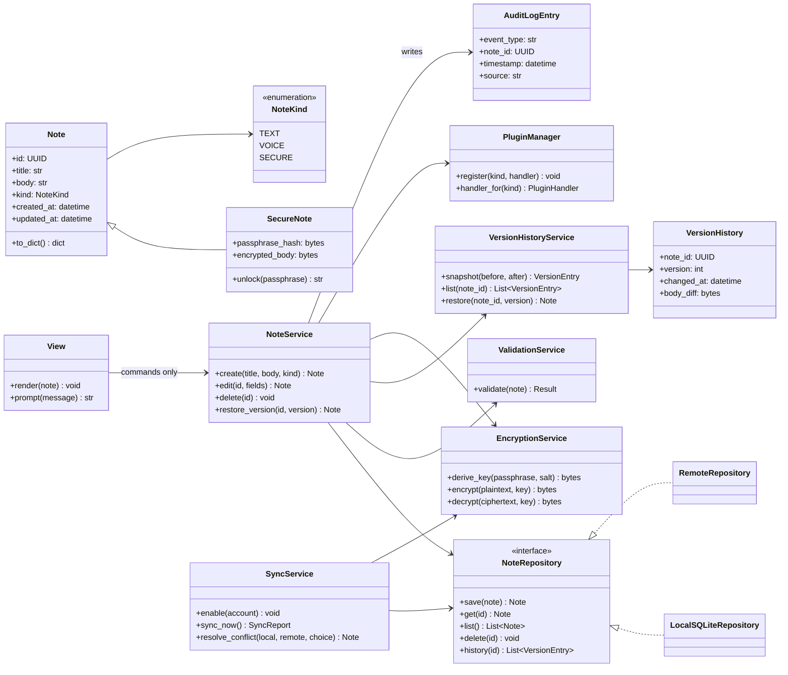
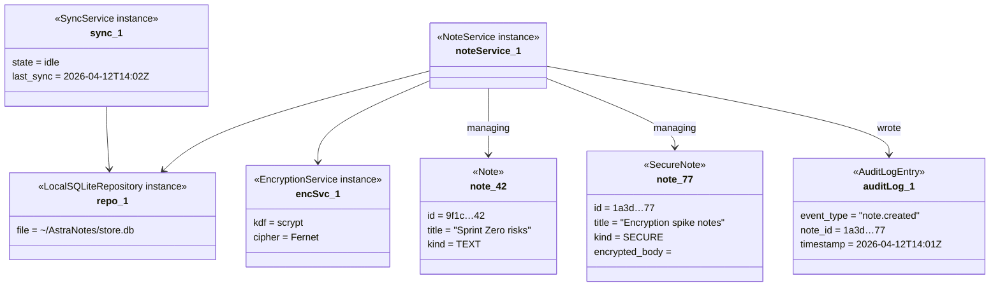
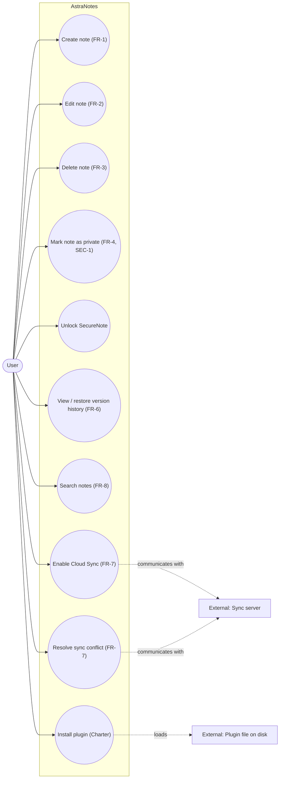
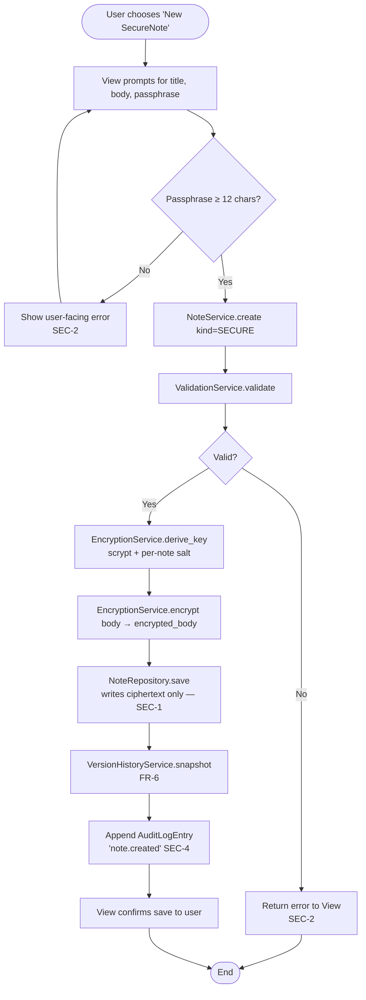
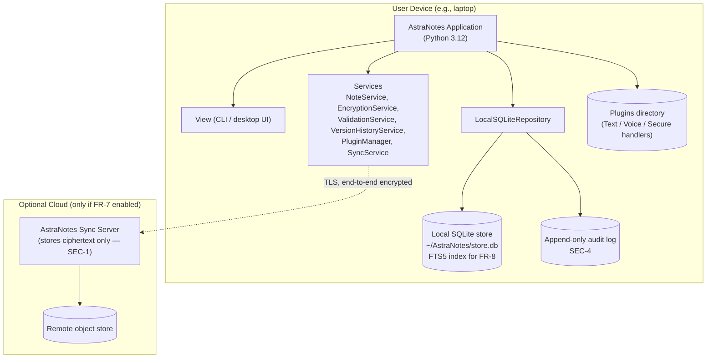

# Submission — Lab 4.2: Complete UML Design Package for AstraNotes

**Project:** AstraNotes
**Lab:** Week 4.2
**Chosen Technical Path:** Python 3

This package presents one connected UML view of AstraNotes. Names, requirement IDs, and architectural responsibilities match the upstream artifacts (`submission-ArchitectureDecisionLog.md`, `submission-RefinedRequirements.md`, `submission-BacklogAndSprintZero.md`). Each diagram below is a Mermaid fenced block so it renders inline on GitHub and most markdown previewers; a short prose summary follows each diagram for viewers that don't render Mermaid.

---

## 1. Class Diagram

The structural backbone of AstraNotes. Model classes (`Note`, `SecureNote`, `VersionHistory`, `AuditLogEntry`) are isolated from view-layer code per NFR-2. The `NoteRepository` interface is what makes `LocalSQLiteRepository` and (future) `RemoteRepository` swappable for FR-7.

**Summary.** `Note` is the base entity; `SecureNote` extends it with the encryption fields required by SEC-1. `NoteRepository` is the persistence contract — `LocalSQLiteRepository` is the Phase-1 implementation, `RemoteRepository` is the slot Cloud Sync (FR-7) plugs into without rewriting callers. `NoteService` is the only entry point for the `View`, satisfying NFR-2.

---

## 2. Object Diagram

A runtime snapshot showing one user session with one ordinary Note and one SecureNote in flight, plus an active local repository and the pending sync.

**Summary.** Two notes exist — one TEXT, one SECURE. Only the SECURE note carries `encrypted_body`. The single `LocalSQLiteRepository` instance is shared by both `NoteService` and `SyncService`, demonstrating that Cloud Sync (FR-7) operates on the same data without bypassing the encryption boundary (SEC-1).

---

## 3. Use Case Diagram

User goals. Drawn as a Mermaid `flowchart` because the GitHub-flavored Mermaid does not have a native use-case diagram type; the actor / use-case relationship is preserved through grouping.

**Summary.** Ten primary use cases, all initiated by the User. Two external actors are present: the sync server (only used when FR-7 is enabled) and a plugin file on disk (loaded by `PluginManager`). Use cases for SecureNotes (`uc4`, `uc5`) cleanly separate "marking" from "unlocking" because the two actions touch different services.

---

## 4. Activity Diagram — "Create and Save a SecureNote"

The most security-sensitive workflow in the system; shows where ValidationService, EncryptionService, VersionHistoryService, and AuditLog hook in.

**Summary.** Body plaintext exists only in memory between steps F and G; it is never passed to the Repository, never written to the audit log, and never returned to the View after save. Validation and SEC-2 graceful-failure paths are explicit.

---

## 5. Deployment Diagram

Where the system actually runs. AstraNotes is local-first; the Sync server is an optional component the user opts into.

**Summary.** All required components run locally: View, Services, Repository, SQLite store, audit log, and plugin directory. The Sync server is shown as an optional zone — if the user does not enable FR-7, the cloud zone is unused. Even when sync is enabled, the server only ever holds ciphertext (SEC-1), so an FR-7 outage does not put SecureNote contents at risk.

---

## 6. Rationale — Why the Five Views Fit Together

These diagrams describe the same AstraNotes design from five complementary angles:

- The **class diagram** is the structural backbone; every later view names classes that appear here.
- The **object diagram** shows that backbone in motion — one concrete moment with one Note, one SecureNote, one Repository, and a queued sync — confirming that nothing in the runtime requires a class outside the structural model.
- The **use case diagram** shifts to user goals and confirms the requirement set (FR-1 through FR-8 plus SecureNote unlock and plugin install) is fully addressed by the structural backbone.
- The **activity diagram** zooms into the most security-sensitive workflow ("Create and Save a SecureNote") and shows where ValidationService, EncryptionService, VersionHistoryService, and the audit log hook in. Every requirement that touches that workflow (FR-1, FR-4, FR-5, FR-6, NFR-2, SEC-1, SEC-2, SEC-4) has a visible step.
- The **deployment diagram** anchors all of the above to physical reality: the User Device runs everything required, and the optional Cloud zone exists solely to serve FR-7 without ever holding plaintext.

A reader who looks at any one diagram can find the same component in the others under the same name. That consistency is the whole point of the package — the Week 5 traceability matrix in `submission-TraceabilityMatrix.md` exploits it directly.

---

## How AI helped

I used Copilot Chat to draft the initial class skeleton and the activity-diagram steps. Refinements I made:

- Renamed an AI-suggested `AuthManager` back to `EncryptionService` because it duplicated responsibilities and broke the locked vocabulary from `submission-ArchitectureDecisionLog.md`.
- Removed an AI-suggested `Database` god-class and replaced it with the `NoteRepository` interface + `LocalSQLiteRepository` / `RemoteRepository` pair — that split is what makes FR-7 a swap rather than a rewrite.
- Added the explicit "View → NoteService commands only" arrow because the AI's first draft had the View calling the Repository directly, which violates NFR-2.
- Wrote the activity diagram around SecureNote creation specifically (not generic "save") because the lab's "design must match scope" criterion is best satisfied by the workflow that combines the most requirements.
- Hand-wrote the rationale; the AI's first attempt was a generic "diagrams complement each other" summary that could have been written about any project.
