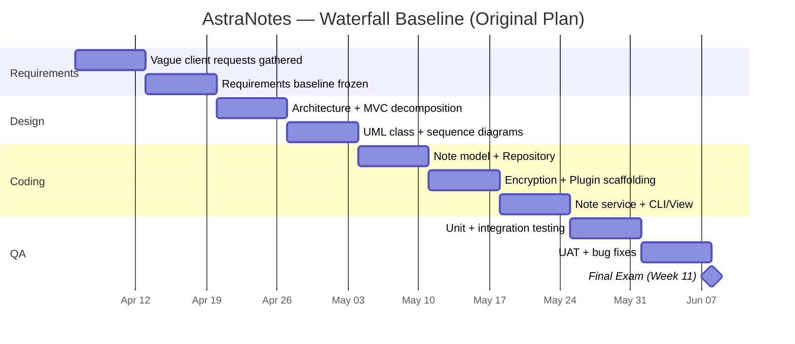
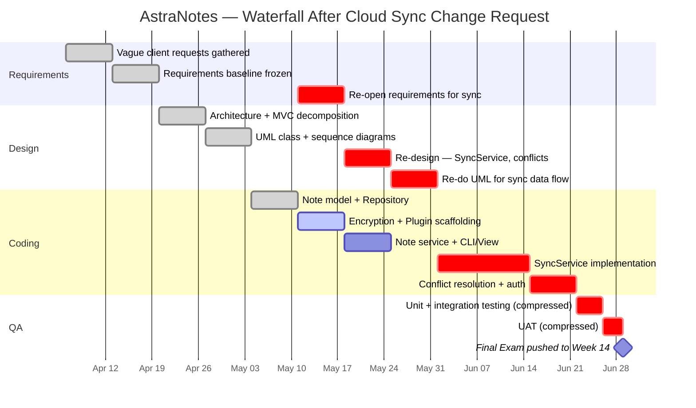

# Submission — Lab 1.1: AstraNotes Waterfall Baseline & Friction Test

**Project:** AstraNotes
**Lab:** Week 1.1
**Chosen Technical Path:** Python 3

---

## 1. Baseline — 10-Week Linear Waterfall

The phases are strictly sequential with no overlap. Final Exam falls at Week 11.

Total: 10 weeks of work + Final Exam at Week 11. No phase can begin until the prior phase is signed off.

---

## 2. Change Request Injected Mid-Lab — "Cloud Sync Integration"

The client now wants notes to sync across devices. In a Waterfall plan, this change cannot land cleanly because Requirements and Design have already been frozen and Coding has begun. The plan re-opens upstream phases, re-does design work, and pushes the timeline.

Tasks shown in **red** are new or rework caused by the change request.

The Final Exam date slips from Week 11 to **Week 14** even after compressing QA from 14 days to 7 days.

---

## 3. Reflection — The Sacrifice

To attempt to meet the deadline we cut combined unit/integration testing and UAT in half (from 14 days to 7), which means encryption and conflict-resolution paths will ship without the same depth of test coverage as the original local-first features — exactly the kind of compromise that tends to hide the bug that bites in production.

---

## How AI helped

I used Copilot Chat to brainstorm the initial 10-week phase split, then rejected its first pass because it overlapped Coding and QA (which violates the Waterfall constraint of the lab). The AI also proposed a 12-week baseline; I refined it to 10 weeks per the assignment. The "sacrifice" sentence is mine — Copilot suggested several softer options ("we will buffer QA"), which I rejected because the lab is meant to expose Waterfall's rigidity, not paper over it.
